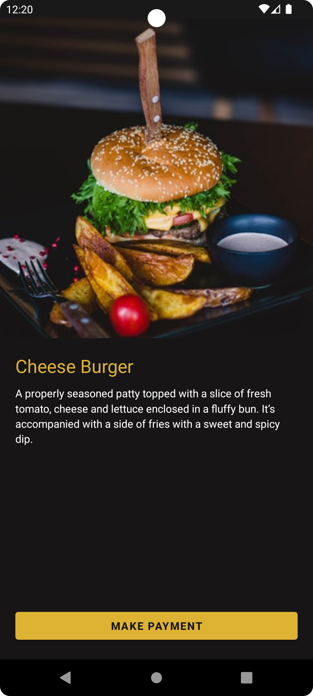
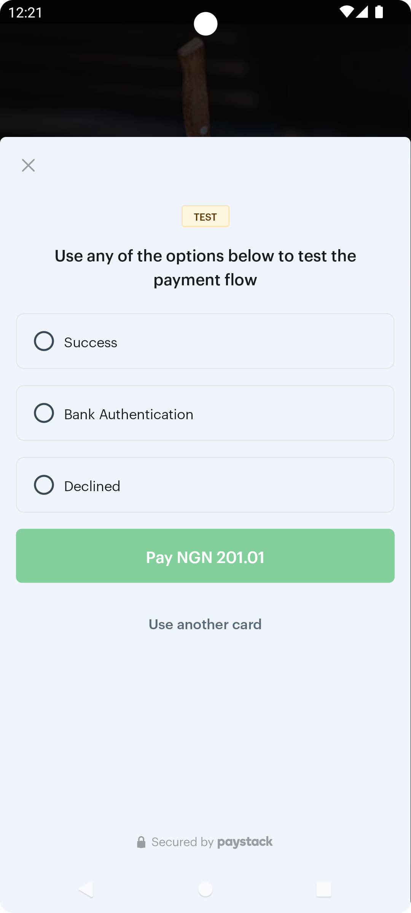

# FoodCheckout
A simple application that shows how to integrate the Paystack SDK into your Android app. There's an
accompanying guide that explains how you should go about your integration:

    
    

# Project Setup
- Clone project and open on Android Studio
- The Java source code is on the `main` branch while the Kotlin is on the `kotlin` branch:
    - To use the Kotlin source code: `git checkout kotlin`
    - To use the Java source code: `git checkout main`
- Sync project
- Run the project when sync is successful